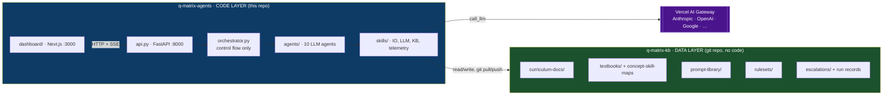
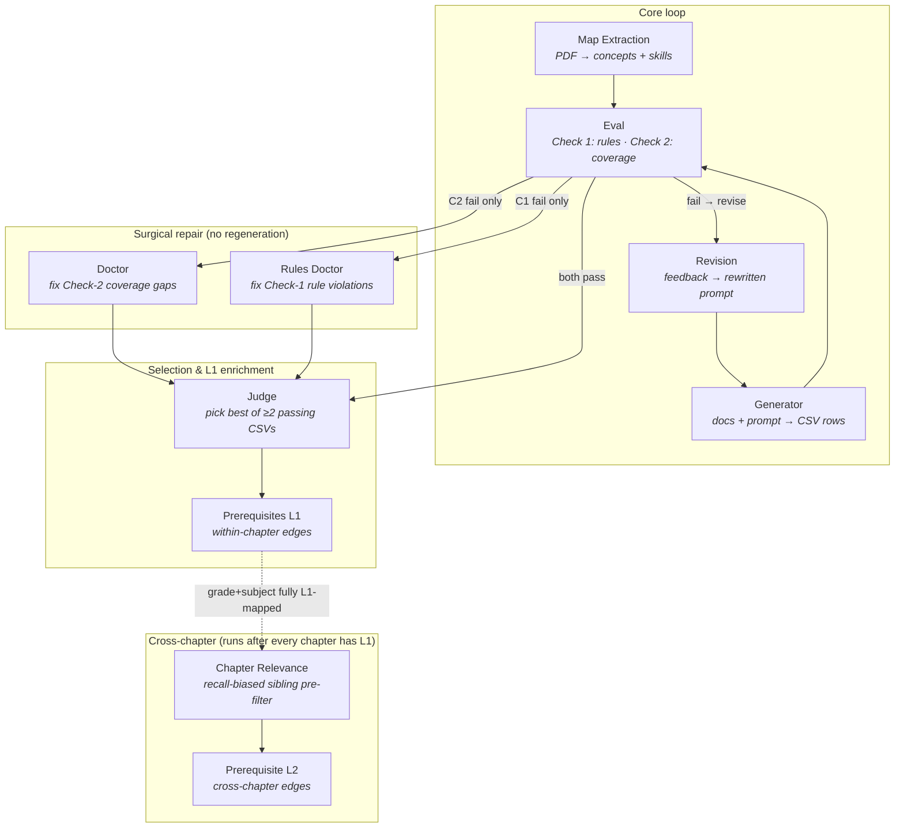
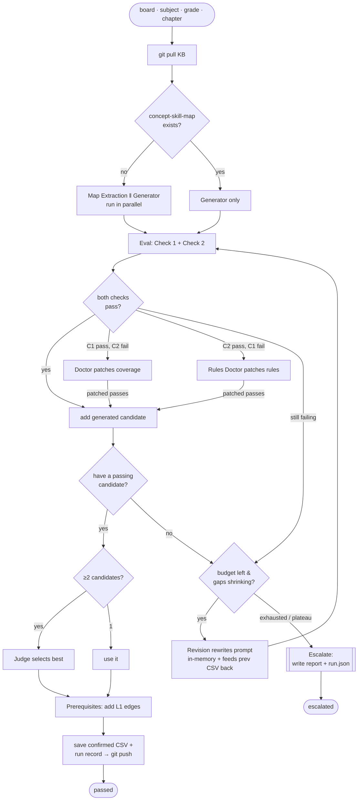
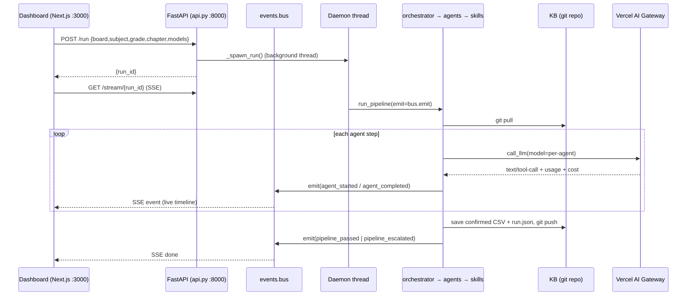
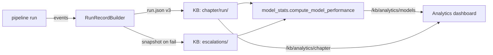

# Q-Matrix — System Architecture

> How the **code layer** (`q-matrix-agents`) and the **data layer** (`q-matrix-kb`) fit
> together to turn raw curriculum documentation into validated, prerequisite-mapped
> curriculum CSVs — automatically, with a human in the loop only on escalation.

This document reflects the system **as built** (10 agents, doctor/judge/prerequisite
stages, model-per-agent routing, live dashboard). The top-level `README.md` is a
quick-start overview; this file is the source of truth for architecture questions.

---

## 1. What the system produces

Given a `Board · Subject · Grade · Chapter`, the pipeline emits a validated CSV mapping:

```
Board → Subject → Grade → Chapter → Concept → Skill   (+ L1 and L2 prerequisite columns)
```

Every row is checked against **universal rules** (Check 1) and against a per-chapter
**concept-skill-map** extracted from the textbook (Check 2). A passing CSV is enriched
with within-chapter (L1) prerequisite edges and committed back to the knowledge base.
Once every chapter in a grade+subject has L1 edges, a separate pass adds cross-chapter
(L2) prerequisite edges. A run that can't pass after its attempt budget is **escalated**
to a human with a full report.

---

## 2. The two repositories

The system is deliberately split into a stateless code repo and a stateful data repo.



| | `q-matrix-agents` (this repo) | `q-matrix-kb` (`KB_ROOT`) |
|---|---|---|
| Role | Behavior — orchestrator, agents, skills, API, dashboard | State — inputs and accumulated outputs |
| Contains | Python + TypeScript, no curriculum data | Structured data only, no code, no secrets |
| Versioning | Normal git | git (LFS for PDFs); the pipeline commits to it per run |
| Coupling | Knows the KB layout in exactly **one** file: `skills/kb_access.py` | Knows nothing about the code |

`KB_ROOT` (in `.env`) is the local path to the cloned KB. It is the single seam between
the two repos — every path resolves relative to it.

---

## 3. The knowledge base layout

`skills/kb_access.py` is the **only** module aware of this structure. Everything else
asks it for data by `(board, subject, grade, chapter)`.

```
q-matrix-kb/
├── curriculum-docs/{board}/{subject}/{grade}/         ← LO PDFs (primary generation input)
├── textbooks/{board}/{subject}/{grade}/{chapter}/     ← enumeration root
│   ├── chapter.pdf                                     ← Map Extraction input
│   ├── concept-skill-map.json                          ← Check-2 ground truth
│   ├── confirmed_curriculum.csv                        ← final passing output (+ prereqs)
│   └── run/  → run.json + report.md + CSV/prompt artifacts   ← per-chapter telemetry
├── prompt-library/{board}/{subject}/
│   ├── base_prompt.md                                  ← subject-level (emerges via cold start)
│   └── {grade}/prompt.md                               ← grade-specific (only when needed)
├── rulesets/
│   ├── universal_rules.md                              ← manually seeded; the ONLY hand-written input
│   └── {board}/{subject}/{grade}/rules.md              ← written when a human rejects a passed CSV
└── escalations/{board}/{subject}/{grade}/{chapter}/{date}/  ← run.json + report.md snapshot
```

**Prompts are never hand-written.** They emerge: cold-start generation runs off
`universal_rules.md`; if it passes, that becomes `base_prompt.md`; if it fails, the
Revision agent adapts it. A grade that misbehaves under a working subject prompt gets
its own `{grade}/prompt.md`, leaving the base untouched.

---

## 4. The agent roster

Ten single-responsibility agents. Each loads its system prompt from
`prompts/<name>_prompt.md` and reaches the LLM through `skills/llm.py`. Every call is
**model-per-agent** (see §7) and returns `{usage, cost_usd}` for telemetry.



| Agent | Responsibility | Key output | LLM call style |
|---|---|---|---|
| **Map Extraction** | Extract flat `concepts` + verb-led `skills` from `chapter.pdf` | `concept-skill-map.json` written to KB | free-text JSON |
| **Generator** | Produce curriculum CSV rows from docs + prompt/rules; edit-in-place on retry | `{csv, input_type, rows}` | forced tool call (`submit_concept_skill_rows`), 3 retries |
| **Eval** | Check 1 (content rules, LLM + deterministic structural checks) and Check 2 (CSM coverage) **in parallel** | `{check1, check2, passed}` | Check 1 forced tool call; Check 2 via `skills/diff.py:diff_full` |
| **Revision** | Rewrite the generation prompt so a reported failure won't recur; subject vs grade mode | `(revised_prompt, …)` — held **in memory only** | single free-text call |
| **Doctor** | Surgically patch a CSV that passed C1 but failed C2 (add missing coverage) | patched `{csv, rows}` | forced tool call, 2 attempts |
| **Rules Doctor** | Mirror of Doctor: fix C1 rule violations without losing C2 coverage | patched `{csv, rows}` | forced tool call, 2 attempts |
| **Judge** | Choose the single best CSV when ≥2 candidates already pass both checks | `{chosen_id, rationale, candidates[]}` | free-text JSON + deterministic fallback |
| **Prerequisites (L1)** | Map within-chapter concept→concept and skill→skill "comes-before" edges | rows enriched with 2 prereq columns | free-text JSON, 2 attempts; never raises |
| **Chapter Relevance** | Recall-biased pre-filter: given target chapter + sibling titles/concepts/skills, flag siblings plausible enough for the full L2 pass | `{relevant_chapters, warnings}` | single free-text JSON call |
| **Prerequisite (L2)** | Given a target chapter's CSV + the relevance-screened candidate pool from other chapters in the same grade+subject, map cross-chapter prerequisite edges | rows enriched with 2 cross-chapter prereq columns | free-text JSON, 2 attempts; never raises |

The orchestrator itself makes **no LLM calls** — it is pure control flow.

---

## 5. The pipeline control flow

`orchestrator.run_pipeline()` drives a bounded generate → evaluate → repair/revise loop
(`MAX_ATTEMPTS = 6`, with an adaptive early-stop after `MAX_PLATEAU_ROUNDS = 2`
non-improving attempts).



Key behaviors worth knowing:

- **Ephemeral prompts.** Revised prompts thread through a run *in memory only* — they are
  never written to the shared prompt library mid-run, so one chapter's revisions can't
  contaminate its siblings or race a concurrent batch.
- **Repair before regenerate.** A near-miss CSV is patched surgically (Doctor / Rules
  Doctor) rather than regenerated from scratch — cheaper and it preserves correct rows.
- **Stop on first shippable candidate.** The checks define the quality bar; once any
  candidate clears both, the loop stops instead of hunting for a marginally cleaner one.
- **Adaptive budget.** The loop stops early once the generator stops closing gaps, so a
  stuck chapter doesn't burn the whole attempt ceiling.
- **Escalation is graceful.** Generation failures, parse errors, and exhausted budgets all
  produce a persisted report + `run.json` rather than a crash — the dashboard and any
  batch queue always advance.

### Human-in-the-loop re-entry

| Trigger | Handler | Effect |
|---|---|---|
| `--human-feedback "…"` | fed into Revision on attempt 1 | steer generation without changing rules |
| `--reject --reason "…"` | `handle_reject` → `append_grade_rule` | encode the rejection as a persistent grade rule, then re-run |
| `--re-extract --map-guidance "…"` | `handle_re_extract` → `save_extraction_guidance` | re-extract the concept-skill-map with guidance, then re-run |

---

## 6. Runtime topology (dashboard ⇄ API ⇄ orchestrator)



- **Two processes.** FastAPI on `:8000`, Next.js dev server on `:3000`. The dashboard
  calls the backend **cross-origin directly** (CORS-allowlisted) rather than through
  Next's rewrite proxy — the proxy hop buffers the SSE stream and adds latency.
- **Every run is a background daemon thread.** The POST returns a `run_id` immediately;
  progress flows back over SSE via the in-process `utils/events.py` bus.
- **Read vs. write side.** Run/reject/re-extract are the write side (they mutate the KB).
  The `/kb/*` and `/kb/analytics/*` endpoints are the read side — they read `run.json` and
  escalations live from the KB filesystem on each request.

### API surface (`api.py`)

| Group | Endpoints |
|---|---|
| Runs (write) | `POST /run`, `POST /reject`, `POST /re-extract`, `POST /run-prerequisite-only` |
| Live stream | `GET /stream/{run_id}` (SSE), `GET /runs`, `GET /runs/{run_id}` |
| Model catalog | `GET /models` (proxies the Gateway catalog, 1h cache) |
| KB browse | `GET /kb/boards · /kb/subjects · /kb/grades · /kb/chapters` |
| Analytics | `GET /kb/analytics`, `/kb/analytics/models`, `/kb/analytics/chapter`, `/kb/analytics/chapter/run/file` |

### Dashboard (`dashboard/`)

- **`/`** — pipeline console: run form, chapter queue (batch, drained sequentially), live
  agent timeline (SSE), CSV compare/diff, and an escalation panel.
- **`/analytics`** — run history, **model-performance** rollup (pass rate, avg tokens/cost
  per agent+model), and a per-chapter drill-down. Filters are URL-query-driven.
- ⚠️ `dashboard/AGENTS.md` notes this is a **forked Next.js** with breaking changes — read
  the bundled guides in `node_modules/next/dist/docs/` before editing dashboard code.

---

## 7. Model routing & the LLM gateway

All agents share one thin wrapper, `skills/llm.py`, pointed at the **Vercel AI Gateway**
via the OpenAI Chat Completions-compatible shape (`base_url=https://ai-gateway.vercel.sh/v1`).
That shape lets a single client hit any provider — Anthropic, OpenAI, Google, Meta,
Mistral, DeepSeek — with identical forced-tool-choice behavior.

- **Model is per-call.** `run_pipeline(models={...})` threads an agent→model dict; each
  agent key falls back to `AGENT_DEFAULT_MODELS`. Defaults route Map Extraction, Generator,
  and Eval to `anthropic/claude-sonnet-5` (fuller CSVs + a reliable eval gate) and the rest
  to `openai/gpt-5.4-mini` (cheaper, sufficient for repair/revision/judge/prereq).
- **Costing is free.** The Gateway returns a pre-computed `cost` per call, so there is no
  local price table — every model, any provider, priced automatically.
- `call_llm` → free text; `call_llm_structured` → forced single tool call returning JSON.
  Retries (`RateLimitError`/`InternalServerError`) live here, not in agent code.

---

## 8. Skills layer (shared capabilities)

| Module | Responsibility |
|---|---|
| `kb_access.py` | **Sole** owner of the KB on-disk layout; all loads/saves of prompts, rules, maps, CSVs, run records, escalations |
| `git_sync.py` | `pull_kb()` at run start, `push_kb()` at run end (commit + push); orchestrator-only |
| `llm.py` | Vercel AI Gateway wrapper; `call_llm`, `call_llm_structured`, usage/cost extraction |
| `pdf_reader.py` | `pdfplumber` text extraction (Map Extraction, curriculum docs) |
| `csv_utils.py` | Parse/validate the fixed CSV schema; holds the LLM tool JSON schemas |
| `diff.py` | Two-pass semantic coverage diff (CSV vs. concept-skill-map) — the engine behind Eval Check 2 |
| `run_record.py` | `RunRecordBuilder` — assembles the structured `run.json` (schema v3) from run events; pure, no IO |
| `report_render.py` | Renders human-readable `report.md` from a run record (single source for `run/` and escalations) |
| `model_stats.py` | Aggregates run records into the dashboard's model-performance rollup |
| `file_io.py` | Filesystem primitives; strips Obsidian YAML frontmatter on read |

---

## 9. Telemetry & data flow

Every run accumulates a structured record and pushes it back to the KB, closing the loop
that feeds the analytics dashboard.



`run.json` records, per attempt: generator output, both eval checks, doctor/rules-doctor
patches, revisions, the judge's selection, and pipeline-level usage — each tagged with
model id, token usage, and USD cost. That is what makes per-agent, per-model performance
comparison possible in the dashboard.

---

## 10. Repository map (quick reference)

```
q-matrix-agents/
├── orchestrator.py        ← control flow (no LLM calls); CLI + programmatic entry
├── api.py                 ← FastAPI backend (:8000), SSE, analytics
├── agents/                ← 10 single-responsibility LLM agents
├── prompts/               ← one system prompt per agent
├── skills/                ← IO · LLM gateway · KB access · git sync · telemetry
├── utils/events.py        ← in-process pub/sub bus for SSE
├── dashboard/             ← Next.js live console + analytics (:3000)
├── scripts/               ← sync_textbooks_from_drive.py (Google Drive → KB)
├── tests/                 ← agent + skill + revision-loop tests
└── graphify-out/          ← generated code-graph analysis artifact (dev tooling, not runtime)
```

