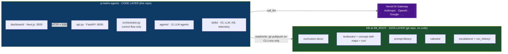
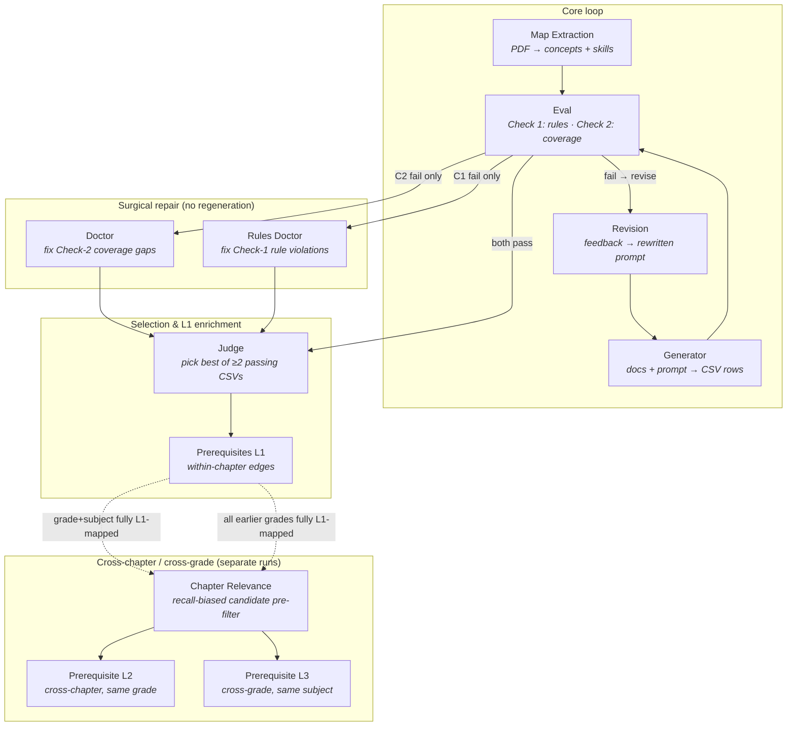
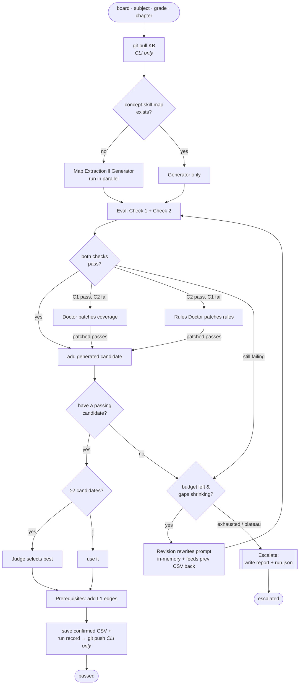
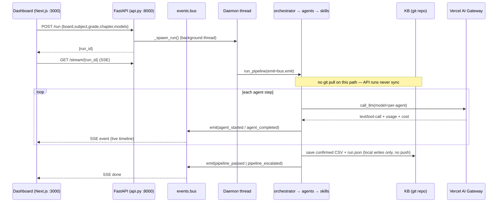
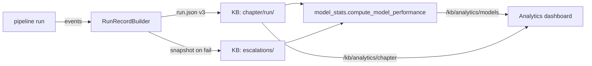

# Q-Matrix — System Architecture

> How the **code layer** (`q-matrix-agents`) and the **data layer** (the KB at `KB_ROOT`,
> structured per [`q-matrix-kb-template`](https://github.com/MaximusTitan/q-matrix-kb-template))
> fit together to turn raw curriculum documentation into validated, prerequisite-mapped
> curriculum CSVs — automatically, with a human in the loop only on escalation.

This document reflects the system **as built** (11 agents, doctor/judge/prerequisite L1–L3
stages, model-per-agent routing, live dashboard). The top-level `README.md` is a
quick-start overview; this file is the source of truth for architecture questions.

---

## 1. What the system produces

Given a `Board · Subject · Grade · Chapter`, the pipeline emits a validated CSV mapping:

```
Board → Subject → Grade → Chapter → Concept → Skill   (+ L1/L2/L3 prerequisite columns)
```

Every row is checked against **universal rules** (Check 1) and against a per-chapter
**concept-skill-map** extracted from the textbook (Check 2). A passing CSV is enriched
with within-chapter (L1) prerequisite edges and committed back to the knowledge base.
Once every chapter in a grade+subject has L1 edges, a separate pass adds cross-chapter
(L2) edges; once every chapter in every *earlier* grade of the subject has L1 edges, a
further pass adds cross-grade (L3) edges. A cross-subject (L4) level is planned but **not
implemented**. A run that can't pass after its attempt budget is **escalated** to a human
with a full report.

Board, subject, grade, and chapter identifiers are **exact folder names** under `KB_ROOT` —
`Grade 8` (with the space), `Chapter04_Exploring_Forces`. There is no normalization layer.

---

## 2. The two repositories

The system is deliberately split into a stateless code repo and a stateful data repo.


```mermaid
graph LR
    subgraph CODE["q-matrix-agents  ·  CODE LAYER (this repo)"]
        ORCH[orchestrator.py<br/>control flow only]
        AGENTS[agents/ · 11 LLM agents]
        SKILLS[skills/ · IO, LLM, KB, telemetry]
        API[api.py · FastAPI :8000]
        DASH[dashboard/ · Next.js :3000]
    end

    subgraph KB["KB at KB_ROOT  ·  DATA LAYER (git repo, no code)"]
        DOCS[curriculum-docs/]
        BOOKS[textbooks/ + concept-skill-maps + run/]
        PROMPTS[prompt-library/]
        RULES[rulesets/]
        ESC[escalations/ + run_history/]
    end

    GATEWAY[[Vercel AI Gateway<br/>Anthropic · OpenAI · Google · …]]

    DASH -->|HTTP + SSE| API
    API --> ORCH
    ORCH --> AGENTS
    AGENTS --> SKILLS
    SKILLS -->|read/write; git pull/push on CLI runs only| KB
    SKILLS -->|call_llm| GATEWAY

    style CODE fill:#0d3b66,color:#fff
    style KB fill:#1b512d,color:#fff
    style GATEWAY fill:#4a148c,color:#fff
```

| | `q-matrix-agents` (this repo) | the KB (`KB_ROOT`) |
|---|---|---|
| Role | Behavior — orchestrator, agents, skills, API, dashboard | State — inputs and accumulated outputs |
| Contains | Python + TypeScript, no curriculum data | Structured data only, no code, no secrets |
| Versioning | Normal git | git (LFS for PDFs); the pipeline commits to it per run |
| Coupling | Knows the KB layout in exactly **one** file: `skills/kb_access.py` | Knows nothing about the code |

`KB_ROOT` (in `.env`) is the local path to the cloned KB. It is the single seam between
the two repos — every path resolves relative to it.

---

## 3. The knowledge base layout

`skills/kb_access.py` is the **only** module aware of this structure. Everything else
asks it for data by `(board, subject, grade, chapter)`.

```
$KB_ROOT/
├── curriculum-docs/{board}/{subject}/{grade}/         ← LO PDFs (primary generation input)
├── textbooks/{board}/{subject}/{grade}/{chapter}/     ← enumeration root
│   ├── chapter.pdf                                     ← Map Extraction input
│   ├── concept-skill-map.json                          ← Check-2 ground truth
│   ├── confirmed_curriculum.csv                        ← final passing output (+ prereqs)
│   └── run/{full,l1_prereq,l2,l3}/                     ← per-stage telemetry, one subtree per stage
│         → run.json + report.md + CSV/prompt artifacts
├── prompt-library/{board}/{subject}/
│   ├── base_prompt.md                                  ← subject-level (read-only to the pipeline)
│   └── {grade}/prompt.md                               ← grade-specific (read-only to the pipeline)
├── rulesets/
│   ├── universal_rules.md                              ← manually seeded; the ONLY hand-written input
│   └── {board}/{subject}/{grade}/rules.md              ← written when a human rejects a passed CSV
├── run_history/{board}/{subject}/{grade}/{chapter}/    ← archived records, {run_id}.json (never overwritten)
└── escalations/{board}/{subject}/{grade}/{chapter}/{date}/  ← run.json + report.md snapshot
```

The `run/` subfolder is stage-tagged via `kb_access._RUN_STAGE_SLUGS`, keyed on the run
record's `mode`: `full → full`, `prerequisite_only → l1_prereq`,
`l2_prerequisite_only → l2`, `l3_prerequisite_only → l3`. Each stage owns its own
`confirmed.csv` / `report.md` / `run.json`, so an L2 or L3 run never clobbers the full
pipeline's cost and usage data. Unlisted modes fall back to a slug derived from the mode
string.

**Prompts are read, never written, by the pipeline.** `kb_access.load_prompt` resolves
`{grade}/prompt.md` → `base_prompt.md` → `universal_rules.md` (cold start) and reports
which level it used. Revised prompts stay in memory for the duration of a run (see §5);
since commit `84151f7` nothing in `orchestrator.py` or `api.py` calls
`kb_access.save_prompt`, so `base_prompt.md` and `{grade}/prompt.md` only exist if a human
writes them. `universal_rules.md` is the only required hand-written input.

---

## 4. The agent roster

Eleven single-responsibility agents. Each loads its system prompt from
`prompts/<name>_prompt.md` and reaches the LLM through `skills/llm.py`. Every call is
**model-per-agent** (see §7) and returns `{usage, cost_usd}` for telemetry.


```mermaid
graph TD
    subgraph CORE["Core loop"]
        MAP["Map Extraction<br/><i>PDF → concepts + skills</i>"]
        GEN["Generator<br/><i>docs + prompt → CSV rows</i>"]
        EVAL["Eval<br/><i>Check 1: rules · Check 2: coverage</i>"]
        REV["Revision<br/><i>feedback → rewritten prompt</i>"]
    end
    subgraph REPAIR["Surgical repair (no regeneration)"]
        DOC["Doctor<br/><i>fix Check-2 coverage gaps</i>"]
        RDOC["Rules Doctor<br/><i>fix Check-1 rule violations</i>"]
    end
    subgraph FINAL["Selection & L1 enrichment"]
        JUDGE["Judge<br/><i>pick best of ≥2 passing CSVs</i>"]
        PRE["Prerequisites L1<br/><i>within-chapter edges</i>"]
    end
    subgraph L23["Cross-chapter / cross-grade (separate runs)"]
        SCREEN["Chapter Relevance<br/><i>recall-biased candidate pre-filter</i>"]
        PREL2["Prerequisite L2<br/><i>cross-chapter, same grade</i>"]
        PREL3["Prerequisite L3<br/><i>cross-grade, same subject</i>"]
    end

    MAP --> EVAL
    GEN --> EVAL
    EVAL -->|C1 fail only| RDOC
    EVAL -->|C2 fail only| DOC
    EVAL -->|fail → revise| REV
    REV --> GEN
    DOC --> JUDGE
    RDOC --> JUDGE
    EVAL -->|both pass| JUDGE
    JUDGE --> PRE
    PRE -.grade+subject fully L1-mapped.-> SCREEN
    PRE -.all earlier grades fully L1-mapped.-> SCREEN
    SCREEN --> PREL2
    SCREEN --> PREL3
```

| Agent | Responsibility | Key output | LLM call style |
|---|---|---|---|
| **Map Extraction** | Extract flat `concepts` + verb-led `skills` from `chapter.pdf` | `concept-skill-map.json` written to KB | free-text JSON |
| **Generator** | Produce curriculum CSV rows from docs + prompt/rules; edit-in-place on retry | `{csv, input_type, rows}` | forced tool call (`submit_concept_skill_rows`), 3 retries |
| **Eval** | Check 1 (content rules, model + deterministic structural checks) and Check 2 (CSM coverage) **in parallel** | `{check1, check2, passed}` | Check 1 (default Sonnet): forced tool call; on Jev, one yes/no per (rule, row) / (rule, concept) with counts in code. Check 2 (default Jev): one yes/no per expected item + a choice naming its covering item(s); on a chat model, `skills/diff.py:diff_full`'s two-pass LLM diff |
| **Revision** | Rewrite the generation prompt so a reported failure won't recur; subject vs grade mode | `(revised_prompt, …)` — held **in memory only** | single free-text call |
| **Doctor** | Surgically patch a CSV that passed C1 but failed C2 (add missing coverage) | patched `{csv, rows}` | forced tool call, 2 attempts |
| **Rules Doctor** | Mirror of Doctor: fix C1 rule violations without losing C2 coverage | patched `{csv, rows}` | forced tool call, 2 attempts |
| **Judge** | Choose the single best CSV when ≥2 candidates already pass both checks | `{chosen_id, rationale, candidates[]}` | Default (Jev): four rubric scores per candidate, weighted; rationale assembled from the scores. Chat model: free-text JSON. Deterministic fallback either way |
| **Prerequisites (L1)** | Map within-chapter concept→concept and skill→skill "comes-before" edges | rows enriched with 2 prereq columns | Default (Sonnet): free-text JSON, 2 attempts. On Jev: one yes/no per same-kind pair, cycles broken in code. Never raises |
| **Chapter Relevance** | Recall-biased pre-filter: given target chapter + sibling titles/concepts/skills, flag siblings plausible enough for the full L2 pass | `{relevant_chapters, warnings}` | Default (Jev): one yes/no per sibling chapter. Chat model: single free-text JSON call |
| **Prerequisite (L2)** | Given a target chapter's CSV + the relevance-screened candidate pool from other chapters in the same grade+subject, map cross-chapter prerequisite edges | rows enriched with 2 cross-chapter prereq columns | Default (Sonnet): free-text JSON, 2 attempts. On Jev: per-candidate screen, then one yes/no per surviving pair. Never raises |
| **Prerequisite (L3)** | Given a target chapter's CSV + the relevance-screened candidate pool from chapters in *earlier grades* of the same subject (or an alias subject), map cross-grade prerequisite edges | rows enriched with 2 prior-grade prereq columns | Default (Sonnet): free-text JSON, 2 attempts. On Jev: as L2, plus a "long-assumed foundations are not prerequisites" criterion. Never raises |

The orchestrator itself makes **no LLM calls** — it is pure control flow.

### Prerequisite levels, precisely

| Level | Agent module | Columns | Precondition helper (`skills/kb_access.py`) |
|---|---|---|---|
| L1 | `agents/prerequisite.py` | `prereq_concepts_L1_same_chapter`, `prereq_skills_L1_same_chapter` | none — runs inline at the end of a full pipeline run |
| L2 | `agents/prerequisite_l2.py` | `prereq_concepts_L2_cross_chapter`, `prereq_skills_L2_cross_chapter` | `grade_subject_l1_complete(board, subject, grade)` |
| L3 | `agents/prerequisite_l3.py` | `prereq_concepts_L3_prior_grade`, `prereq_skills_L3_prior_grade` | `subject_prior_grades_l1_complete(board, subject, grade)` |
| L4 (cross-subject) | — | — | **planned; not implemented** — no module, prompt, endpoint, or model key exists |

Both preconditions return `False` (not an error) for an empty candidate pool, so
"no earlier grades" is never mistaken for "ready".

**L3 candidate discovery.** `earlier_grades(board, subject, grade)` returns
`(source_subject, grade)` pairs strictly before the target grade, sorted by
`_grade_sort_key`. It scans the target subject *plus* any alias in
`_PREREQ_SUBJECT_ALIASES` — currently `{"Science": ("Environmental Science",)}`, because
CBSE only introduces Science as a standalone subject from Grade 6 and Grades 3–5 cover the
same ground as EVS. **Aliasing applies to L3 only**; `grade_subject_l1_complete` and
`list_chapters_in_grade_subject` stay exact-match on subject.
`load_confirmed_csvs_for_subject_prior_grades` then batch-loads every earlier-grade
chapter's confirmed CSV, keyed grade → chapter.

**L3 token control.** L2 runs one Chapter Relevance screen over a single grade's siblings.
L3 runs the same unmodified `screen()` **once per earlier grade**, so each screening call
stays the size of an L2 call no matter how many prior grades exist. Chapter Relevance has
no model key of its own — it runs on whichever model the enclosing L2/L3 run uses.

**L3 semantics.** Edges are written only onto the target (downstream) chapter's CSV;
earlier-grade chapters are read-only inputs. Cells hold
`{"grade", "chapter", "concept"|"skill", "reason"}` entries — `grade` is required because
chapter names are not unique across grades. As in L1/L2, the skill→concept lift
(if skill A is prerequisite to skill B, then concept(A) is prerequisite to concept(B)) is
applied deterministically in code, and unioned with any concept edges the LLM returned.
Per product decision, L3 deliberately does not assert long-assumed foundational
dependencies; that guardrail lives in `prompts/prerequisite_l3_prompt.md`, not in code.

Completion state is read back off the CSV, not tracked separately:
`confirmed_csv_has_l3_prereqs` (a level ran *and* found at least one edge) vs.
`confirmed_csv_l3_attempted` (the L3 columns are present at all — "ran, found nothing"),
with L1/L2 equivalents alongside.

---

## 5. The pipeline control flow

`orchestrator.run_pipeline()` drives a bounded generate → evaluate → repair/revise loop
(`MAX_ATTEMPTS = 6`, with an adaptive early-stop after `MAX_PLATEAU_ROUNDS = 2`
non-improving attempts).


```mermaid
flowchart TD
    START([board · subject · grade · chapter]) --> PULL[git pull KB<br/><i>CLI only</i>]
    PULL --> MAPQ{concept-skill-map<br/>exists?}
    MAPQ -->|no| PAR[Map Extraction ‖ Generator<br/>run in parallel]
    MAPQ -->|yes| GENONLY[Generator only]
    PAR --> EVAL[Eval: Check 1 + Check 2]
    GENONLY --> EVAL

    EVAL --> BOTH{both checks<br/>pass?}
    BOTH -->|yes| CAND[add generated candidate]

    BOTH -->|C1 pass, C2 fail| DOC[Doctor patches coverage]
    BOTH -->|C2 pass, C1 fail| RDOC[Rules Doctor patches rules]
    DOC -->|patched passes| CAND
    RDOC -->|patched passes| CAND

    CAND --> HAVE{have a passing<br/>candidate?}
    HAVE -->|yes| SELECT

    BOTH -->|still failing| BUDGET{budget left &<br/>gaps shrinking?}
    HAVE -->|no| BUDGET
    BUDGET -->|yes| REV[Revision rewrites prompt<br/>in-memory + feeds prev CSV back]
    REV --> EVAL
    BUDGET -->|exhausted / plateau| ESC[[Escalate:<br/>write report + run.json]]

    SELECT{≥2 candidates?} -->|yes| JUDGE[Judge selects best]
    SELECT -->|1| PICK[use it]
    JUDGE --> PRE
    PICK --> PRE
    PRE[Prerequisites: add L1 edges] --> SAVE[save confirmed CSV +<br/>run record → git push <i>CLI only</i>]
    SAVE --> DONE([passed])
    ESC --> DONE2([escalated])
```

Key behaviors worth knowing:

- **Ephemeral prompts.** Revised prompts thread through a run *in memory only*
  (`working_prompt` in the orchestrator, `prompt_override` on the Generator) — they are
  never written to the shared prompt library, so one chapter's revisions can't contaminate
  its siblings or race a concurrent batch. The tradeoff is that a revision is discarded at
  the end of the run: nothing is carried forward to the next chapter or the next run.
  `kb_access.save_prompt` still exists but has no pipeline caller (see §3).
- **Repair before regenerate.** A near-miss CSV is patched surgically (Doctor / Rules
  Doctor) rather than regenerated from scratch — cheaper and it preserves correct rows.
- **Stop on first shippable candidate.** The checks define the quality bar; once any
  candidate clears both, the loop stops instead of hunting for a marginally cleaner one.
- **Adaptive budget.** The loop stops early once the generator stops closing gaps, so a
  stuck chapter doesn't burn the whole attempt ceiling.
- **Escalation is graceful.** Generation failures, parse errors, and exhausted budgets all
  produce a persisted report + `run.json` rather than a crash — the dashboard and any
  batch queue always advance.

### Human-in-the-loop re-entry

| Trigger | Handler | Effect |
|---|---|---|
| `--human-feedback "…"` | fed into Revision on attempt 1 | steer generation without changing rules |
| `--reject --reason "…"` | `handle_reject` → `append_grade_rule` | encode the rejection as a persistent grade rule, then re-run |
| `--re-extract --map-guidance "…"` | `handle_re_extract` → `save_extraction_guidance` | re-extract the concept-skill-map with guidance, then re-run |

### Entry points, and which have a CLI

`orchestrator.py`'s argparse exposes only `--board --subject --grade --chapter
--human-feedback --reject --reason --re-extract --map-guidance --prereq-csv --no-sync`.
There is no L2 or L3 flag — those stages are reachable only through the API (and therefore
the dashboard), which imports the orchestrator's entry functions directly.

| Stage | Entry function (`orchestrator`) | CLI | API route |
|---|---|---|---|
| Full pipeline (ends with L1) | `run_pipeline` | ✅ default invocation | `POST /run` |
| L1 only, from a CSV file | `run_prerequisite_only` | ✅ `--prereq-csv` (identifiers derived from the CSV; no git sync) | `POST /run-prerequisite-only` |
| L2 | `run_l2_prerequisite_only` | ❌ | `POST /run-l2-prerequisite` |
| L3 | `run_l3_prerequisite_only` | ❌ | `POST /run-l3-prerequisite` |
| Reject | `handle_reject` | ✅ `--reject --reason` | `POST /reject` |
| Re-extract | `handle_re_extract` | ✅ `--re-extract --map-guidance` | `POST /re-extract` |

The L2/L3 preconditions are checked twice on purpose: the route rejects with HTTP 400 up
front, and the entry function re-checks defensively because KB state can change between the
route's check and the background thread actually starting.

---

## 6. Runtime topology (dashboard ⇄ API ⇄ orchestrator)


```mermaid
sequenceDiagram
    participant U as Dashboard (Next.js :3000)
    participant A as FastAPI (api.py :8000)
    participant B as events.bus
    participant T as Daemon thread
    participant O as orchestrator → agents → skills
    participant K as KB (git repo)
    participant G as Vercel AI Gateway

    U->>A: POST /run {board,subject,grade,chapter,models}
    A->>T: _spawn_run() (background thread)
    A-->>U: {run_id}
    U->>A: GET /stream/{run_id} (SSE)
    T->>O: run_pipeline(emit=bus.emit)
    Note over O,K: no git pull on this path — API runs never sync
    loop each agent step
        O->>G: call_llm(model=per-agent)
        G-->>O: text/tool-call + usage + cost
        O->>B: emit(agent_started / agent_completed)
        B-->>U: SSE event (live timeline)
    end
    O->>K: save confirmed CSV + run.json (local writes only, no push)
    O->>B: emit(pipeline_passed | pipeline_escalated)
    B-->>U: SSE done
```

- **Two processes.** FastAPI on `:8000`, Next.js dev server on `:3000`. The dashboard
  calls the backend **cross-origin directly** (CORS-allowlisted) rather than through
  Next's rewrite proxy — the proxy hop buffers the SSE stream and adds latency.
- **Every run is a background daemon thread.** The POST returns a `run_id` immediately;
  progress flows back over SSE via the in-process `utils/events.py` bus.
- **No git on the API path.** `pull_kb()` / `push_kb()` are called from
  `orchestrator.main()` only — `run_pipeline` and the prereq entry functions never touch
  git. So API- and dashboard-triggered runs write to the local `KB_ROOT` and stop there;
  committing and pushing is a manual step. The `no_sync` field on the request models
  defaults to `True` and is never forwarded to the orchestrator, so it is currently inert;
  `dashboard/src/lib/api.ts` sends `no_sync: true` on every POST anyway.
- **Read vs. write side.** Run/reject/re-extract and the L1/L2/L3 prereq runs are the write
  side (they mutate the KB).
  The `/kb/*` and `/kb/analytics/*` endpoints are the read side — they read `run.json` and
  escalations live from the KB filesystem on each request.

### API surface (`api.py`)

21 routes total.

| Group | Endpoints |
|---|---|
| Runs (write) | `POST /run`, `POST /reject`, `POST /re-extract`, `POST /run-prerequisite-only`, `POST /run-l2-prerequisite`, `POST /run-l3-prerequisite` |
| Live stream | `GET /stream/{run_id}` (SSE), `GET /runs`, `GET /runs/{run_id}` |
| Model catalog | `GET /models` (proxies the Gateway catalog, 1h cache) |
| KB browse | `GET /kb/boards · /kb/subjects · /kb/grades · /kb/chapters` |
| Eligibility | `GET /kb/l2-eligible-chapters`, `GET /kb/l3-eligible-chapters` (the latter also returns `prior_grade_count`) |
| Analytics | `GET /kb/analytics`, `/kb/analytics/models`, `/kb/analytics/chapter`, `/kb/analytics/chapter/run/file` |
| Static | `GET /` (serves the bundled HTML dashboard if `static/` exists) |

> **Security posture.** There is **no authentication or authorization on any route**,
> including the six write/run routes above — which spend API credits, mutate the KB, and can
> `git push`. The only access control is `CORSMiddleware` with
> `allow_origins=["http://localhost:3000"]`, and CORS is a browser-side policy, not a server
> guard. `api.py` is a localhost development tool; bind it to `127.0.0.1` and do not expose
> it. See [SECURITY.md](SECURITY.md).

### Dashboard (`dashboard/`)

- **`/`** — pipeline console. The run form (`run-form.tsx`) has four modes:
  `generate` (full pipeline from the KB), `csv` (L1 prereqs only on a pasted CSV),
  `l2`, and `l3` — the last two delegating to `l2-run-form.tsx` / `l3-run-form.tsx`.
  Alongside it: collapsible per-agent model overrides, a chapter queue (batch, drained
  sequentially, and queueable in L2/L3 mode too), live agent timeline (SSE), CSV
  compare/diff, a prerequisite-mapping summary with per-chapter breakdown, run history, and
  an escalation panel.
- **`/analytics`** — run history, **model-performance** rollup (pass rate, avg tokens/cost
  per agent+model), and a per-chapter drill-down. Filters are URL-query-driven.
- ⚠️ `dashboard/AGENTS.md` notes this is a **forked Next.js** with breaking changes — read
  the bundled guides in `node_modules/next/dist/docs/` before editing dashboard code.

---

## 7. Model routing & the LLM gateway

Agents reach the **Vercel AI Gateway** through one of two thin wrappers:

- `skills/llm.py` — the OpenAI Chat Completions-compatible shape
  (`base_url=https://ai-gateway.vercel.sh/v1`), for agents that write something. That
  shape lets a single client hit any chat provider — Anthropic, OpenAI, Google, Meta,
  Mistral, DeepSeek — with identical forced-tool-choice behavior.
- `skills/evaluate.py` — the Gateway's `POST /v1/evaluate` endpoint, for agents that
  decide something. Evaluation models (TypeSafe's Jev, `typesafe-ai/jev`) do not generate
  text; they answer typed questions about a shared `state` — `boolean` (a probability),
  `choice` (one of ≤255 named options) or `score` (a rung on a rubric). Each decision
  agent therefore splits its judgment into many small questions and assembles its usual
  output (edges, feedback strings, a verdict) in code. Jev's limit is 32k tokens for the
  state plus the longest question; `call_evaluate` refuses an oversized request before
  sending it. Questions sharing a state are batched (`MAX_QUESTIONS_PER_REQUEST`) and
  requests run in parallel. Decision thresholds are named constants in each agent.

- **Model is per-call.** `run_pipeline(models={...})` threads an agent→model dict; each
  agent key falls back to `orchestrator.AGENT_DEFAULT_MODELS`. There are twelve keys
  (`AGENT_KEYS`). `eval` runs Check 1 and `eval_coverage` runs Check 2; a caller that sets
  only `eval` gets it for both. `chapter_relevance` runs the L2/L3 screens. Every decision
  agent has both a chat-model path and an evaluation-model path, picked by model id
  (`skills.evaluate.is_evaluation_model`).

  | Default model | Agents |
  |---|---|
  | `anthropic/claude-sonnet-5` | `map_extraction`, `generator`, `doctor`, `rules_doctor`, `revision`, `eval` (Check 1), `prerequisite`, `prerequisite_l2`, `prerequisite_l3` |
  | `typesafe-ai/jev` | `eval_coverage` (Check 2), `judge`, `chapter_relevance` |

  Jev is the default only where it held up in calibration against Sonnet 5 verdicts
  (2026-09-27: 63 escalated attempts with stored verdicts, 12 confirmed CBSE EVS Grade 3
  chapters). Check 2 agreed on pass/fail 81% of the time. Check 1 did not separate
  passing from failing CSVs at any threshold, and L1 prerequisites recovered only 18% of
  stored edges, so both stay on Sonnet; the numbers are recorded beside each threshold
  constant and in `orchestrator.py`. Prerequisite edges stay **unverified** on any model.
- **Costing is free.** The Gateway returns a pre-computed `cost` per call, so there is no
  local price table — every model, any provider, priced automatically.
- `call_llm` → free text; `call_llm_structured` → forced single tool call returning JSON;
  `call_evaluate` / `evaluate_many` → typed answers. Retries (rate limits, server errors)
  live in these wrappers, not in agent code.

---

## 8. Skills layer (shared capabilities)

| Module | Responsibility |
|---|---|
| `kb_access.py` | **Sole** owner of the KB on-disk layout; all loads/saves of prompts, rules, maps, CSVs, run records, escalations |
| `git_sync.py` | `pull_kb()` at run start, `push_kb()` at run end (commit + push); orchestrator-only |
| `llm.py` | Vercel AI Gateway wrapper; `call_llm`, `call_llm_structured`, usage/cost extraction |
| `pdf_reader.py` | `pdfplumber` text extraction (Map Extraction, curriculum docs) |
| `csv_utils.py` | Parse/validate the fixed CSV schema; holds the LLM tool JSON schemas |
| `diff.py` | Two-pass semantic coverage diff (CSV vs. concept-skill-map) — the engine behind Eval Check 2 |
| `run_record.py` | `RunRecordBuilder` — assembles the structured `run.json` (schema v3) from run events; pure, no IO |
| `report_render.py` | Renders human-readable `report.md` from a run record (single source for `run/` and escalations) |
| `model_stats.py` | Aggregates run records into the dashboard's model-performance rollup |
| `file_io.py` | Filesystem primitives; strips Obsidian YAML frontmatter on read |

---

## 9. Telemetry & data flow

Every run accumulates a structured record and pushes it back to the KB, closing the loop
that feeds the analytics dashboard.


```mermaid
graph LR
    RUN[pipeline run] -->|events| RRB[RunRecordBuilder]
    RRB -->|run.json v3| KBRUN[KB: chapter/run/]
    RRB -->|snapshot on fail| KBESC[KB: escalations/]
    KBRUN --> MS[model_stats.compute_model_performance]
    KBESC --> MS
    MS -->|/kb/analytics/models| DASH[Analytics dashboard]
    KBRUN -->|/kb/analytics/chapter| DASH
```

`run.json` records, per attempt: generator output, both eval checks, doctor/rules-doctor
patches, revisions, the judge's selection, and pipeline-level usage — each tagged with
model id, token usage, and USD cost. That is what makes per-agent, per-model performance
comparison possible in the dashboard.

---

## 10. Repository map (quick reference)

```
q-matrix-agents/
├── orchestrator.py        ← control flow (no LLM calls); CLI + programmatic entry
├── api.py                 ← FastAPI backend (:8000), SSE, analytics
├── agents/                ← 11 single-responsibility LLM agents
├── prompts/               ← one system prompt per agent (11 .md files)
├── skills/                ← IO · LLM gateway · KB access · git sync · telemetry
├── utils/events.py        ← in-process pub/sub bus for SSE
├── dashboard/             ← Next.js live console + analytics (:3000)
├── scripts/               ← sync_textbooks_from_drive.py (Google Drive → KB)
└── tests/                 ← executable assert scripts, run individually
                             (`python tests/test_skills.py`); not a pytest suite
```

`tests/` contains no `def test_*` functions and `pytest` is not in `requirements.txt` —
each file is a module-level script of `assert`s with a `__main__`-style print trail. Most
load `.env` and exercise the real KB and/or the real Gateway; `tests/test_prerequisite_l3.py`
is the only one that runs fully offline.

